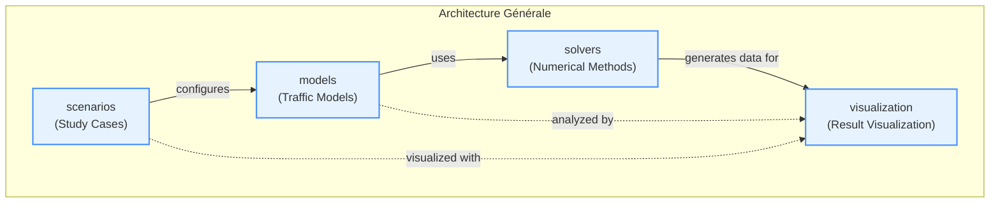

```mermaid
flowchart TD
    subgraph "Architecture Générale"
        Models["models<br>(Traffic Models)"]:::moduleNode
        Scenarios["scenarios<br>(Study Cases)"]:::moduleNode
        Solvers["solvers<br>(Numerical Methods)"]:::moduleNode
        Visualization["visualization<br>(Result Visualization)"]:::moduleNode
        
        Models -->|uses| Solvers
        Scenarios -->|configures| Models
        Solvers -->|generates data for| Visualization
        Models -.->|analyzed by| Visualization
        Scenarios -.->|visualized with| Visualization
    end
    
    classDef moduleNode fill:#e6f3ff,stroke:#4d94ff,stroke-width:2px
```
