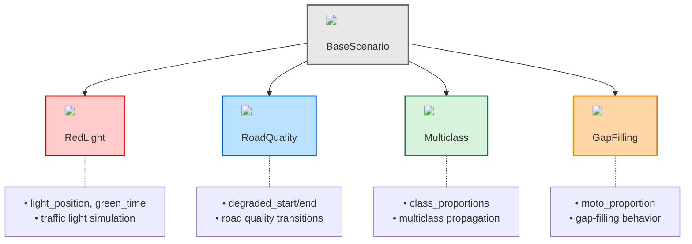

```mermaid
graph TD
    %% Styles
    classDef base fill:#e8e8e8,stroke:#666,stroke-width:2px,color:#333
    classDef traffic fill:#ffcccb,stroke:#cc0000,stroke-width:2px
    classDef road fill:#bae1ff,stroke:#0066cc,stroke-width:2px
    classDef multi fill:#d8f3dc,stroke:#2d6a4f,stroke-width:2px
    classDef gap fill:#ffd6a5,stroke:#fb8500,stroke-width:2px
    
    %% Base scenario
    B[<img src='https://img.icons8.com/ios/50/000000/road-closure.png' width='24'/><br/>BaseScenario]:::base
    
    %% Types of scenarios
    R[<img src='https://img.icons8.com/ios/50/000000/traffic-light.png' width='24'/><br/>RedLight]:::traffic
    Q[<img src='https://img.icons8.com/ios/50/000000/under-construction.png' width='24'/><br/>RoadQuality]:::road
    M[<img src='https://img.icons8.com/ios/50/000000/traffic-jam.png' width='24'/><br/>Multiclass]:::multi
    G[<img src='https://img.icons8.com/ios/50/000000/motorcycle.png' width='24'/><br/>GapFilling]:::gap
    
    %% Connection lines
    B --> R
    B --> Q
    B --> M
    B --> G
    
    %% Properties boxes (more concise)
    R_props["• light_position, green_time<br>• traffic light simulation"]
    Q_props["• degraded_start/end<br>• road quality transitions"]
    M_props["• class_proportions<br>• multiclass propagation"]
    G_props["• moto_proportion<br>• gap-filling behavior"]
    
    R -.- R_props
    Q -.- Q_props
    M -.- M_props
    G -.- G_props
```

