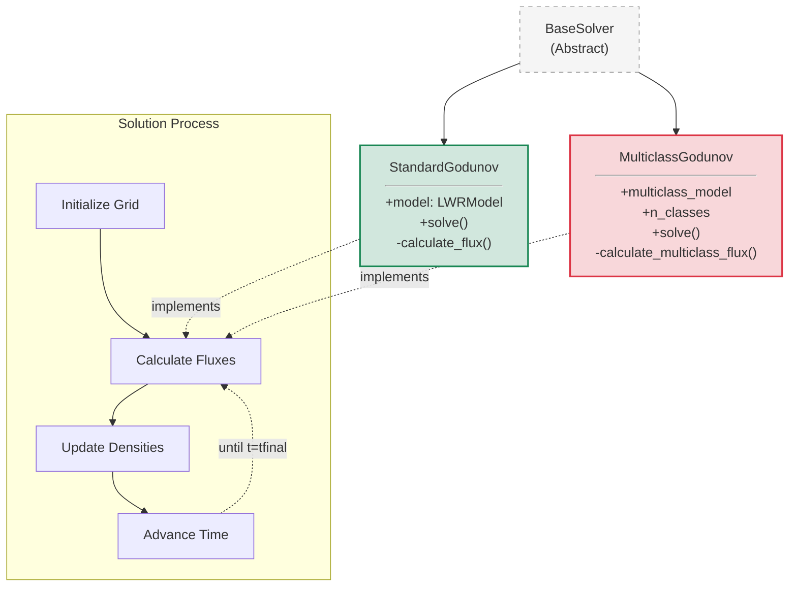

```mermaid
flowchart TD
    %% Style definitions
    classDef abstract fill:#f5f5f5,stroke:#999,stroke-width:1px,stroke-dasharray: 5 5
    classDef standard fill:#d1e7dd,stroke:#198754,stroke-width:2px
    classDef multiclass fill:#f8d7da,stroke:#dc3545,stroke-width:2px
    
    %% Base class
    BaseSolver["BaseSolver<br>(Abstract)"]:::abstract
    
    %% Concrete implementations  
    StdGodunov["StandardGodunov<br><hr>+model: LWRModel<br>+solve()<br>-calculate_flux()"]:::standard
    
    MultiGodunov["MulticlassGodunov<br><hr>+multiclass_model<br>+n_classes<br>+solve()<br>-calculate_multiclass_flux()"]:::multiclass
    
    %% Inheritance relationships
    BaseSolver --> StdGodunov
    BaseSolver --> MultiGodunov
    
    %% Algorithm steps
    subgraph "Solution Process"
        direction TB
        Init["Initialize Grid"]
        Calc["Calculate Fluxes"]
        Update["Update Densities"] 
        Advance["Advance Time"]
    end
    
    Init --> Calc --> Update --> Advance
    Advance -.->|"until t=tfinal"| Calc
    
    %% Connect solvers to process
    StdGodunov -.->|"implements"| Calc
    MultiGodunov -.->|"implements"| Calc
```
