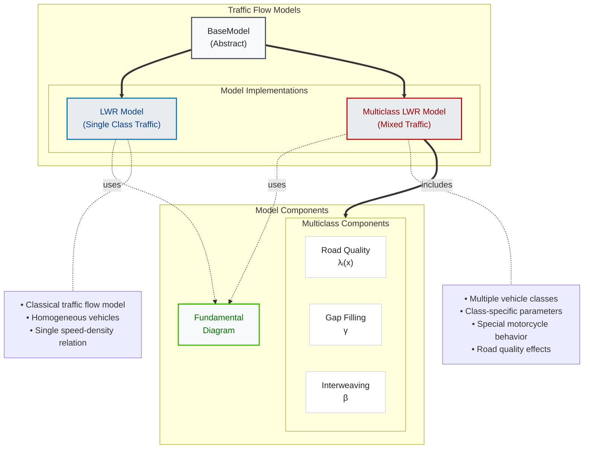

```mermaid
flowchart TD
    %% Style definitions avec des bordures distinctes et des fonds légers
    classDef baseModel fill:#f8f9fa,stroke:#495057,stroke-width:2px,color:#212529
    classDef lwrModel fill:#e9ecef,stroke:#0077b6,stroke-width:2px,color:#023e8a
    classDef multiModel fill:#e9ecef,stroke:#d00000,stroke-width:2px,color:#9d0208
    classDef fundDiagram fill:#f8f9fa,stroke:#38b000,stroke-width:2px,color:#007200
    classDef component fill:#fff,stroke:#ced4da,stroke-width:1px,color:#212529

    %% Organisation structurée des éléments
    subgraph Models ["Traffic Flow Models"]
        direction TB
        Base["BaseModel<br>(Abstract)"]:::baseModel
        
        subgraph Implementation ["Model Implementations"]
            direction LR
            LWR["LWR Model<br>(Single Class Traffic)"]:::lwrModel
            Multi["Multiclass LWR Model<br>(Mixed Traffic)"]:::multiModel
        end
        
        Base ==> LWR
        Base ==> Multi
    end
    
    subgraph Components ["Model Components"]
        direction TB
        FD["Fundamental<br>Diagram"]:::fundDiagram
        
        subgraph MultiComponents ["Multiclass Components"]
            direction LR
            Road["Road Quality<br>λᵢ(x)"]:::component
            Gap["Gap Filling<br>γ"]:::component
            Inter["Interweaving<br>β"]:::component
        end
    end
    
    %% Connections with better styling
    LWR -.->|"uses"| FD
    Multi -.->|"uses"| FD
    Multi ==>|"includes"| MultiComponents
    
    %% Feature descriptions with clear borders
    LWR_Props["• Classical traffic flow model<br>• Homogeneous vehicles<br>• Single speed-density relation"]
    Multi_Props["• Multiple vehicle classes<br>• Class-specific parameters<br>• Special motorcycle behavior<br>• Road quality effects"]

    LWR -.- LWR_Props
    Multi -.- Multi_Props
```
