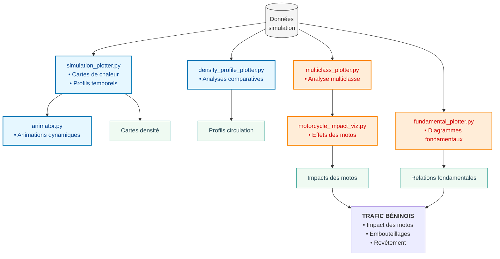

```mermaid
flowchart TD
    %% Style definitions
    classDef input fill:#f5f5f5,stroke:#333,stroke-width:1px,color:#333
    classDef basicViz fill:#e6f7ff,stroke:#0077b6,stroke-width:2px,color:#023e8a
    classDef advancedViz fill:#ffedd8,stroke:#fb8500,stroke-width:2px,color:#d00000
    classDef output fill:#effaf2,stroke:#2a9d8f,stroke-width:1px,color:#264653
    
    %% Input data
    Simulation[(Données<br>simulation)]:::input
    
    %% Vertically organized visualization pipeline
    Simulation --> SimPlotter
    Simulation --> DensityPlotter
    Simulation --> MultiPlotter
    Simulation --> FundPlotter
    
    %% Basic tools arranged vertically
    SimPlotter["simulation_plotter.py<br>• Cartes de chaleur<br>• Profils temporels"]:::basicViz
    DensityPlotter["density_profile_plotter.py<br>• Analyses comparatives"]:::basicViz
    Animator["animator.py<br>• Animations dynamiques"]:::basicViz
    
    %% Advanced tools arranged vertically 
    FundPlotter["fundamental_plotter.py<br>• Diagrammes fondamentaux"]:::advancedViz
    MultiPlotter["multiclass_plotter.py<br>• Analyse multiclasse"]:::advancedViz
    MotoViz["motorcycle_impact_viz.py<br>• Effets des motos"]:::advancedViz
    
    %% Vertical organization of tools
    SimPlotter --> Animator
    MultiPlotter --> MotoViz
    
    %% Output types (compact arrangement)
    SimPlotter --> HeatMaps["Cartes densité"]:::output
    DensityPlotter --> Profiles["Profils circulation"]:::output
    FundPlotter --> Relations["Relations fondamentales"]:::output
    MotoViz --> Impacts["Impacts des motos"]:::output
    
    %% Final insight at the bottom
    Relations --> InsightTraffic
    Impacts --> InsightTraffic
    
    InsightTraffic["<b>TRAFIC BÉNINOIS</b><br>• Impact des motos<br>• Embouteillages<br>• Revêtement"]
```

